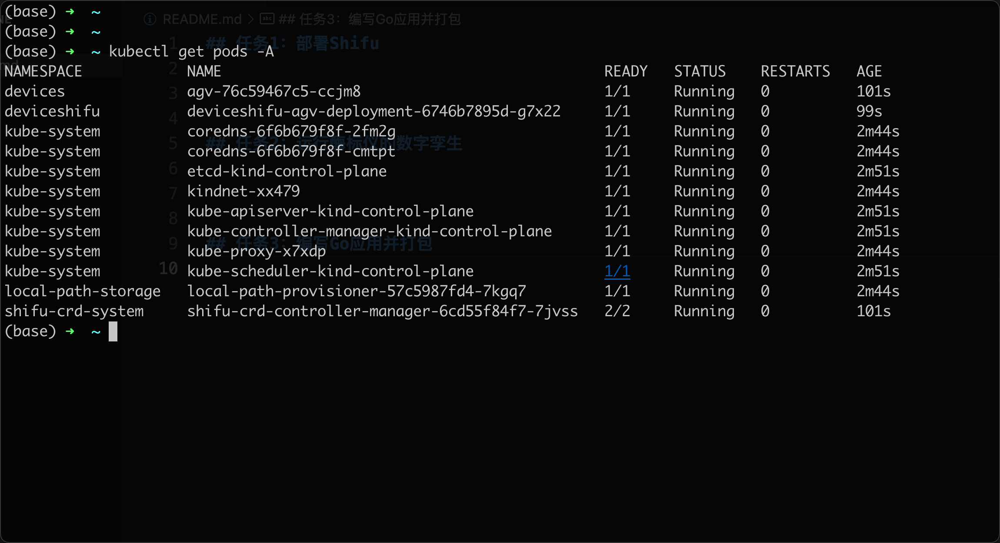
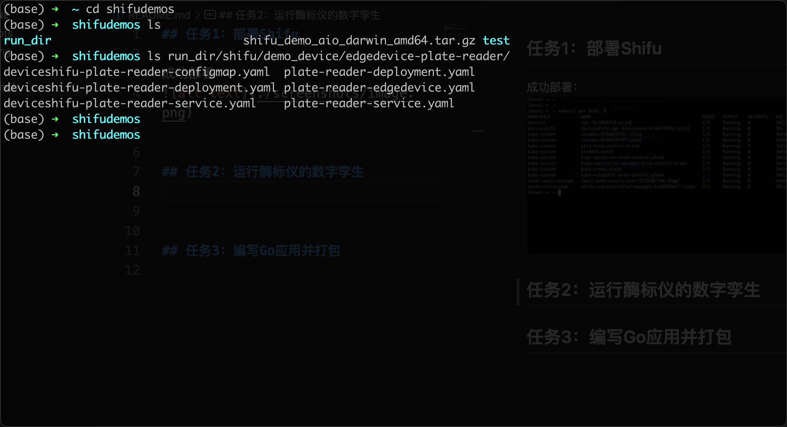
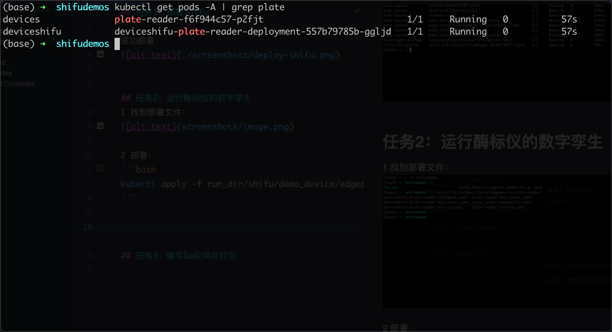
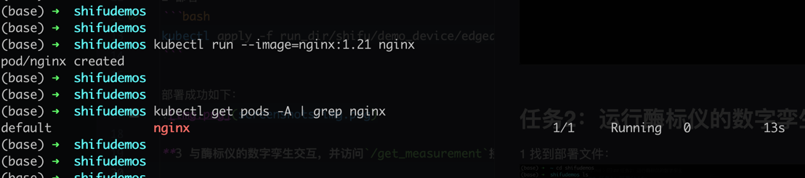
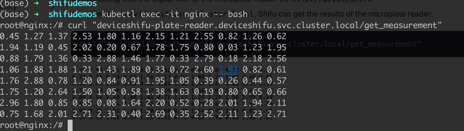
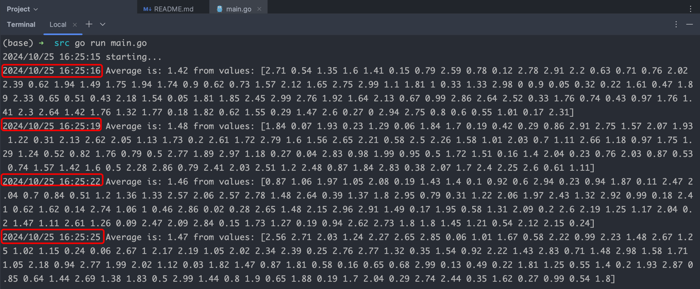

## 任务1：部署Shifu

成功部署：



## 任务2：运行酶标仪的数字孪生
1 找到部署文件：


2 部署：
```bash
kubectl apply -f run_dir/shifu/demo_device/edgedevice-plate-reader
```

部署成功如下：


**3 与酶标仪的数字孪生交互，并访问`/get_measurement`接口**
部署nginx：


交互成功：


## 任务3：编写Go应用并打包镜像，部署到集群中

1 编写代码，定时访问`/get_measurement`，并输出平均值
初步尝试，在本地访问集群，并访问`/get_measurement`接口。
- 代码：`src/main.go`

每三秒访问接口一次，并输出平均值，如下：


2 编写Go应用，并打包


