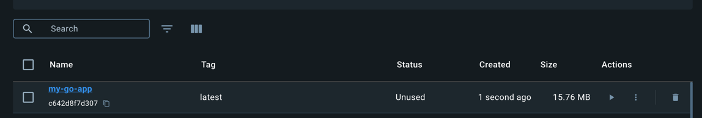
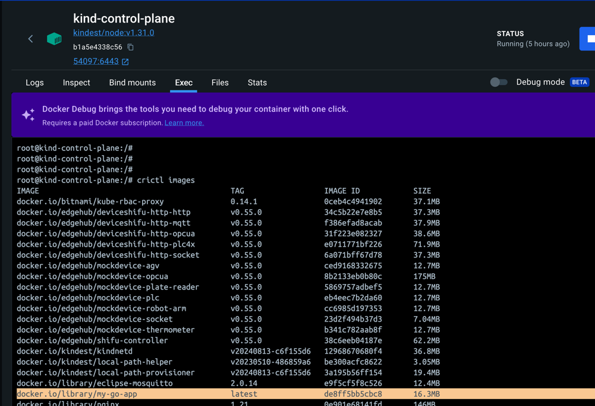
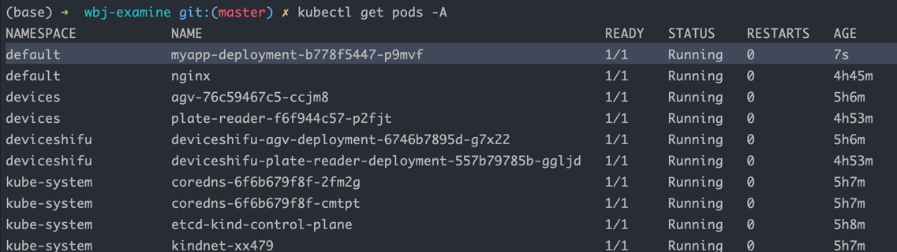
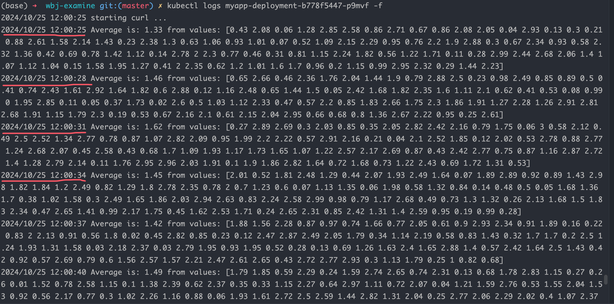

## 任务1：部署Shifu

成功部署：


## 任务2：运行酶标仪的数字孪生
1 找到部署文件：


2 部署：
```bash
kubectl apply -f run_dir/shifu/demo_device/edgedevice-plate-reader
```

部署成功如下：


**3 与酶标仪的数字孪生交互，并访问`/get_measurement`接口**
部署nginx：


交互成功：


## 任务3：编写Go应用并打包镜像，部署到集群中

### 本地代码访问接口尝试
1 编写代码，定时访问`/get_measurement`，并输出平均值
初步尝试，在本地访问集群，并访问`/get_measurement`接口。
- 代码：`src/main.go`

每三秒访问接口一次，并输出平均值，如下：


### 容器内版本代码实现
编写Go应用，并打包
代码：`src2/main.go`
- 每三秒，访问接口一次，并求平均值。
Dockerfile：`./Dockerfile`

### 编译并打包镜像
用宿主机docker编译镜像：
```bash
docker build -t my-go-app .
```


### 加载宿主机镜像到kind集群中
通过kind load 命令将宿主机上的镜像加载到kind k8s 集群中
```bash
kind load docker-image my-go-app:latest
```


### 编写Deployment，部署到集群中
Deployment：`./deploy-myapp.yaml`
```bash
kubectl apply -f deploy-myapp.yaml 
```


### 查看日志输出
```bash
kubectl logs myapp-deployment-b778f5447-p9mvf -f
```
可以清晰的看到，输出日志，并且每3秒访问接口一次，并计算平均值：



